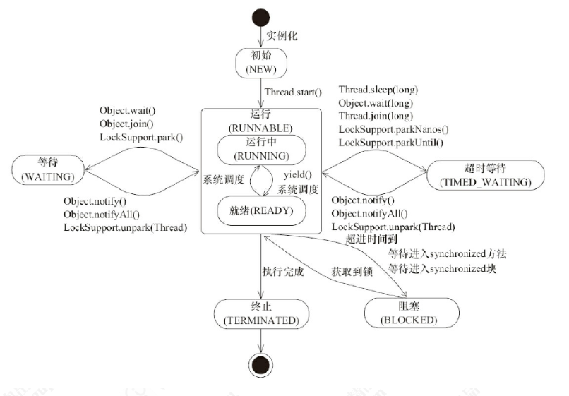
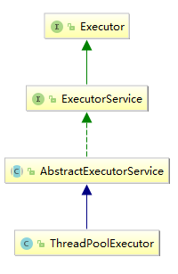
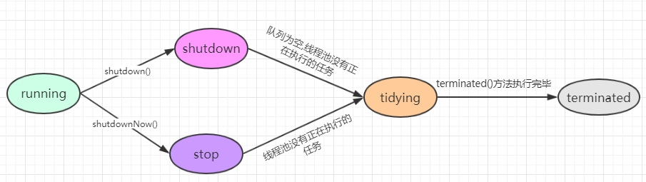

# 							并发编程艺术

## 一并发编程基础

### 1. 线程和进程

1. 进程：它是内存中的一段独立的空间，可以负责当前应用程序的运行。当前这个进程负责调度当前程序中的所有运行细节。
2. 线程：它是位于进程中，负责当前进程中的某个具备独立运行资格的空间。

---


### 2. 创建线程的3种方式

#### 2.1 继承Thread类

> Thread 类本质上是实现了 Runnable 接口的一个实例，代表一个线程的实例。

```java
public class Demo1 {
	public static void main(String[] args) {
		MyThread mt = new MyThread();//4,创建自定义类的对象
		mt.start();                //5,开启线程
	}
}

class MyThread extends Thread {   //1,定义类继承Thread
	public void run() {        		//2,重写run方法
		System.out.println("run");//3,将要执行的代码,写在run方法中
	}
}
```

```java
public void method1(){
    //匿名内部类
    new Thread() {           			
        public void run() {      		
            System.out.println("run thread...");
        }
    }.start();
}
```


#### 2.2 实现Runable接口

```java
public class Demo2 {
	public static void main(String[] args) {
		MyRunnable mr = new MyRunnable();   //4,创建自定义类对象
		Thread t = new Thread(mr);        //5,将其当作参数传递给Thread的构造函数
		t.start();                            //6,开启线程
	}
}

class MyRunnable implements Runnable {  //1,自定义类实现Runnable接口
	public void run() {              //2,重写run方法
		System.out.println("run");//3,将要执行的代码,写在run方法中
	}
}

```

```java
public void method1(){
    //匿名内部类+lamba 简写方式
    new Thread(() -> {
        System.out.println("run");
    }).start();
}
```

#### 2.3 实现Callable接口

`Callable`是jdk1.5新加的,可以获取返回值,可以抛异常

```java
public class Demo3 {

	public static void main(String[] args) throws ExecutionException, InterruptedException {
		ExecutorService executorService= Executors.newFixedThreadPool(1);
		Future<String> future=executorService.submit(new MyCallable());
		String s = future.get(); //通过future来获取返回值,进程没有计算结束,get()会一直阻塞等待
		System.out.println(s);
		executorService.shutdown();//会在所有任务完成的情况下,才会关闭线程池
	}
}

class MyCallable implements Callable { //1,自定义类实现Callable接口
	@Override
	public String call() {
		int a = 1;
		int b = 2;
		return "执行结果:" + (a + b);
	}
}
```

---


### 3. 线程的状态

#### 3.1 线程的6种状态

> 线程一共有 6 种状态（`NEW`、`RUNNABLE`、`BLOCKED`、`WAITING`、`TIME_WAITING`、`TERMINATED`）
>
> 可以通过thread.getState()获取到线程的当前状态

| 状态名称     | 说明                                                         |
| ------------ | ------------------------------------------------------------ |
| NEW          | 初始状态，线程被构建，但是还没有调用 start 方法              |
| RUNNABLED    | JAVA 线程把操作系统中的就绪和运行两种状态统一称为“运行中”    |
| BLOCKED      | 阻塞状态,表示线程==阻塞于锁==                                |
| WAITING      | 等待状态,表示线程进入等待状态,需要其他线程做出一些特定动作(通知或中断),才会退出等待状态 |
| TIME_WAITING | 超时等待状态，该状态不同于WAITING,他是可以在指定时间自行返回的 |
| TERMINATED   | 终止状态，表示当前线程执行完毕                               |

> BLOCKED：阻塞状态，表示线程进入等待状态,也就是线程因为某种原因放弃了 CPU 使用权，阻塞也分为几种情况
>
> 1. 等待阻塞：运行的线程执行 wait 方法(释放锁,然后在该锁上等待)，jvm 会把当前线程放入到等待队列
> 2. 同步阻塞：运行的线程在获取对象的同步锁时，若该同步锁被其他线程锁占用了，那么 jvm 会把当前的线程放入到锁池中,进入到同步阻塞状态中
> 3. 其他阻塞：运行的线程执行 t.join 方法，或者发出了 I/O请求时，JVM 会把当前线程设置为阻塞状态，当 join 线程终止、io 处理完毕则线程恢复



#### 3.2 查看线程状态的方法

1. 打开终端或者命令提示符，键入“jps”，（JDK1.5 提供的一个显示当前所有 java进程 pid 的命令）
2.  根据上一步骤获得的 pid，继续输入 jstack pid（jstack 是 java 虚拟机自带的一种堆栈跟踪工具。jstack 用于打印出给定的 java 进程 ID 或 core file 或远程调试服务的 Java 堆栈信息）

---


### 4. Thread常用的方法

#### 4.1 `sleep`()和`wait()`

| sleep()                                                    | wait()                                                       |
| :--------------------------------------------------------- | :----------------------------------------------------------- |
| 属于Thread的方法                                           | 属于Object的方法                                             |
| sleep(long millis) <br />sleep(long millis,int nanos)      | wait() <br />wait(long millis) <br />wait(long millis,int nanos) |
| <b可以在任何情况下运用<br /> ==该线程被sleep后不会释放锁== | 只能用在同步代码块或同步方法中<br /> ==当该线程被wait时,会释放锁,然后再该锁上等待== |

---


#### 4.2 `setDaemon()`-- 守护线程

##### 4.2.1 原理

> 1. 设置一个线程为守护线程, 该线程不会单独执行, 当其他非守护线程都执行结束后,自动退出
> 2. Main主线程结束了（==Main线程是Non-daemon线程==）,如果此时正在运行的其他threads是daemon threads,JVM会使得这个threads停止,JVM也停下.如果此时正在运行的其他threads有Non-daemon threads,那么必须等所有的Non daemon线程结束了，JVM才会停下来.
> 3. 总之,必须等所有的Non-daemon线程都运行结束了，只剩下daemon的时候，JVM才会停下来


##### 4.2.2 示例

设为守护，则程序在1s后退出。

不守护，则程序死循环输出。

```java
public static void main(String[] args) throws InterruptedException {
    Thread thread = new Thread(() -> {
        int i = 1;
        for (; ; ) {
            System.out.println("hello,world+" + i++);
        }
    });
    // thread.setDaemon(true);   //设置为守护进程
    thread.start();
    Thread.sleep(1000);
}
```

---


#### 4.3 `join()`--加入线程

> 调用 thread.join() 的程进入 TIMED_WAITING 状态，等待 join() 所属线程运行结束后再继续运行。 


##### 4.3.1 **示例**:演示多个线程顺序执行

```java
public class JoinDemo {
    public static void main(String[] args) throws InterruptedException {
        Thread t1 = new Thread(() -> {
            System.out.println("t1");
        });
        Thread t2 = new Thread(() -> {
            System.out.println("t2");
        });
        Thread t3 = new Thread(() -> {
            System.out.println("t3");
        });
        t1.start();
        t1.join();//main线程调用的该方法,main线程会进入wait方法,当t1运行结束时,才会被唤醒(notifyAll)
        t2.start();
        t2.join();
        t3.start();
        t3.join();
    }
}
```

```pro
//输出的结果,就会是线程顺序运行之后的结果
t1
t2
t3
```


##### 4.3.2 **源码解析**

```java
public final void join() throws InterruptedException {
    join(0);
}
//注意方法是synchronized修饰的,wait()只能用在同步代码中,
public final synchronized void join(long millis) throws InterruptedException {
    long base = System.currentTimeMillis();
    long now = 0;

    if (millis < 0) {
        throw new IllegalArgumentException("timeout value is negative");
    }

    if (millis == 0) {
        while (isAlive()) {
            wait(0);
        }
    } else {
        while (isAlive()) {
            long delay = millis - now;
            if (delay <= 0) {
                break;
            }
            wait(delay);
            now = System.currentTimeMillis() - base;
        }
    }
}
```

核心代码:

```java
while (isAlive()) {
　　wait(0); //如果 timeout 为零，则不考虑实际时间，在获得通知前该线程将一直等待。
}
```

isAlive是 join方法的本意和目标。即使中间被唤醒（虚拟唤醒,他仍然会再次调用wait(0)来等待下一次通知。

最终，线程死的时候会调用自己的notifyAll方法，join会执行结束。 

> 当main线程调用t1.join时候，main线程会获得线程对象t1的锁（wait 意味着拿到该对象的锁),调用该对象的wait(等待时间)，直到该对象唤醒main线程 ,然后main线程会被阻塞,知道t1线程运行完,会调用自己的notifyall方法,激活main线程.

---


#### 4.4 `yield()`--礼让线程

当一个线程抢到执行权后，执行到yield()方法后，就会放弃执行权，其他线程就可以拿到执行权 了

####  4.5 ~~`stop`~~--~~弃用的停止线程方法~~

>  thread.stop() 等同于 kill -9 pid ,相当于强制暂定线程,如果线程正在运行任务,会导致一些意外的情况,所以弃用了,我们使用的时候要慎重
>
> 其他因为相同原因弃用的方法: `suspend`、`resume` 

#### 4.6 `interrupt()`-设置线程中断标记

1. 若线程被`Object.wait`, `Thread.join`和`Thread.sleep`三种方法之一阻塞 ，调用了它的interrupt()方法，那么它的“中断状态”会被清除并且会收到一个`InterruptedException`异常

   例如，线程通过sleep()进入阻塞状态，此时通过interrupt()中断该线程；调用interrupt()会立即将线程的中断标记设为“true”，但是由于线程处于阻塞状态，所以该“中断标记”会立即被清除为“false”，同时，会产生一个`InterruptedException`的异常。

   ```java
   public static void main(String[] args) throws InterruptedException {
       Thread thread = new Thread(() -> {
           try {
               Thread.sleep(3000);
           } catch (InterruptedException e) {
               //由于产生InterruptedException异常，线程终止！
               log.info("exception:{}",e.getLocalizedMessage());
           }
       });
       thread.start();
       log.info("1,{}",String.valueOf(thread.isInterrupted()));//false
       thread.interrupt();
       log.info("2,{}",String.valueOf(thread.isInterrupted()));//true
       TimeUnit.SECONDS.sleep(1);
       log.info("3,{}",String.valueOf(thread.isInterrupted()));//false
   }
   ```

   ```properties
   1,false
   2,true
   exception:sleep interrupted
   3,false
   ```

2. 如果线程正常运行,当调用interrupt()方法时,只是会把线程的中断标记设置为"true",不会有其他效果

   例如,我们可以通过获取线程的中断标记值,来中断线程

   ```java
   public static void method1() throws InterruptedException {
       Thread thread = new Thread(() -> {
           //thread.isInterrupted():获取线程的中断标记的值
           while (!Thread.currentThread().isInterrupted()) {
               i++;
           }
           log.info("Num:" + i);
       });
       thread.start();
       TimeUnit.SECONDS.sleep(1);
       thread.interrupt();
   }
   ```

3. interrupt相关的方法

   * new Thread().isInterrupted():获取线程的中断标记值

     ```java
     public boolean isInterrupted() {
       return isInterrupted(false);
     }
     //ClearInterrupted为true时,会复位中断标志
     private native boolean isInterrupted(boolean ClearInterrupted);
     ```

   * Thread.interrupted(): ,获取线程的中断标记值, 并复位线程的中断标记为false(先获取,再复位)

     ```java
     public static boolean interrupted() {
         return currentThread().isInterrupted(true);//参数为ture
     }
     private native boolean isInterrupted(boolean ClearInterrupted);
     
     ```

     ```java
     public static void method2() throws InterruptedException {
         Thread thread = new Thread(() -> {
             while (true) {
                 if (Thread.interrupted()) {//能进循环表示线程的中断标记为true
                     /**
                     但是此处打印的却是false,表示
                     Thread.interrupted():能返回线程的中断状态,但是返回后,就会复位为false
                     **/
                     log.info("status:" + Thread.currentThread().isInterrupted());
                 }
             }
         });
         thread.start();
         log.info("1:"+thread.isInterrupted()); //默认是false
         TimeUnit.SECONDS.sleep(1);
         thread.interrupt();//设置中断标识,中断标识为 true
         log.info("2:"+thread.isInterrupted()); //线程被中断为true
     }
     ```

     ```properties
     14:21:52.572 [main]  - 1:false  
     14:21:53.575 [main]  - 2:true
     14:21:53.575 [Thread-0] - status:false //**能进循环表示线程的中断标记为**
     ```


#### 4.7 如何优雅的停止线程

##### 4.7.1 通过interrupt()方法实现

```java
private static void method2() throws InterruptedException {
    Thread thread = new Thread(() -> {
        try {
            while (!Thread.currentThread().isInterrupted()) {//判断线程中断标记
                Thread.sleep(100); // 休眠100ms
                //do something
            }
        } catch (InterruptedException e) {//用户捕获阻塞线程因中断抛出的异常
            e.printStackTrace();
        }
    });
    thread.start();
    System.out.println("begin start thread");
    Thread.sleep(1000);
    thread.interrupt();
}
```


##### 4.7.2 通过一个标志位实现

```java
//volidate能够保证变量被修改时,其他线程立马刷新新的stop值
private volatile static boolean stop = false;

public static void main(String[] args) throws InterruptedException {
    Thread thread = new Thread(() -> {
        while (!stop) { //通过标志位,来判断是否终止线程
           //do someting
        }
    });
    thread.start();
    System.out.println("begin start thread");
    Thread.sleep(1000);
    stop = true; //设置标志为true来中断线程
}
```


#### 4.8 `setPriority()`-线程的优先级设置

>  thread.setPriority() 设置线程的优先级,范围[1,10],数字越大,线程优先级越高
>
> 需要注意: 有些操作系统可能忽略线程优先级的设定.

### 5. 线程的安全问题

#### 5.1 产生安全问题的原因

> ###### ==多个线程操作共享数据,就会导致出现安全问题,使用时,用这个标准判断==

```java
public class TicketDemo {
    public static void main(String[] args) {
        Ticket ticket = new Ticket();
        new Thread(ticket).start();
        new Thread(ticket).start();
        new Thread(ticket).start();
    }

}

@Slf4j
class Ticket implements Runnable {
    private int ticket = 100;

    public void run() {
        for (; ; ) {
            if (ticket > 0) {
                log.info("出售第{}张票", ticket--);//1
            }
        }
    }
}
```

当线程0走到if中时(1位置),刚判断完后正准备做打印ticket--动作时,cpu被线程1抢走了

这时线程1还是从100张票开始判断,然后打印出售第100张票,ticket--,变成99张票	

此时切换到线程0,由于已经经过了判断,这时还是打印出售第100张票.

所以就会出现同时出售100张票,就出现了安全隐患

#### 5.2 解决方式1:`synchronized`

##### 5.2.1 同步代码块

```java
public class TicketDemo {
	public static void main(String[] args) {
		Ticket ticket = new Ticket();
		new Thread(ticket).start();
		new Thread(ticket).start();
		new Thread(ticket).start();
	}
}
@Slf4j
class Ticket implements Runnable {
	private int ticket = 100;

	public void run() {
		for (; ; ) {
			synchronized (TicketDemo.class){ //多个方法访问,需要使用唯一的锁
				if (ticket > 0) {
					log.info("出售第{}张票", ticket--);
				}
			}
		}
	}
}
```

##### 5.2.2  同步方法

==同步方法也有锁,是隐式的==

==非静态同步方法的锁是:this==

==静态的同步方法的锁是:本类的字节码对象==

```java
public class TicketDemo {
	public static void main(String[] args) {
		Ticket ticket = new Ticket();
		new Thread(ticket).start();
		new Thread(ticket).start();
		new Thread(ticket).start();
	}

}
@Slf4j
class Ticket implements Runnable {
	private int ticket = 100;

	public void run() {
		doTicket();
	}
	public synchronized void doTicket(){ //同步方法
		for (; ; ) {
			synchronized (TicketDemo.class){
				if (ticket > 0) {
					log.info("出售第{}张票", ticket--);
				}
			}
		}
	}
}

```

#### 5.3 解决方式2 :`Lock锁`

Lock接口中有2个方法

* void lock() 获取锁

* void unLock() 释放锁

由于是接口,可以使用它的实现类ReentrantLock

```java
public class TicketDemo {
	public static void main(String[] args) {
		Ticket ticket = new Ticket();
		new Thread(ticket).start();
		new Thread(ticket).start();
		new Thread(ticket).start();
	}
}

@Slf4j
class Ticket implements Runnable {
	private int ticket = 100;
	private Lock lock = new ReentrantLock();//1.创建锁对象
	public void run() {
		for (; ; ) {
			lock.lock(); //2.上锁
			try {
				if (ticket > 0) {
					log.info("出售第{}张票", ticket--);
				}
			} catch (Exception e) {
				e.printStackTrace();
			} finally {
				/*
				  3.写在finally中,会一定释放锁
				  当出现异常时,其他线程可以继续运行
				 */
				lock.unlock();
			}
		}
	}

}
```

具体的锁使用,可以查看后续的锁章节

### 6. 线程通信-`wait()/notify()`

#### 6.1 什么时候需要通信

	多个线程并发执行时, 在默认情况下CPU是随机切换线程的
	
	如果我们希望他们有规律的执行, 就可以使用通信, 例如每个线程执行一次打印

#### 6.2 怎么通信

* 如果希望线程等待, 就调用wait()
  * 当前线程必须拥有此对象的monitor（即锁),才能调用某个对象的wait()方法能让==当前线程阻塞,同时会立即释放锁==
  * 阻塞线程必须有其他线程通过在同一把锁上的notify()/notifyAll()唤醒重新竞争获得锁

* 如果希望唤醒等待的线程, 就调用notify()/notifyAll();

  * notify()/notifyAll()是解除线程在该锁上的waiting状态.	

* ==这两个方法必须在同步代码中执行, 并且使用同步锁对象来调用==


#### 6.3 案例:让两个线程交替执行任务	

> 2个线程,一个生产者producer,一个消费者consumer
>
> producer生产一个apple,然后consumer消费一个apple,周期运行,没有生产不能消费

```java
//资源类:苹果
public class Apple {
    public int index;
    public boolean flag;
    public void product() {
        try {
            Thread.sleep(1000);
        } catch (InterruptedException e) {
            e.printStackTrace();
        }
        System.out.printf("生产第%d个苹果\n",++index);
    }

    public void take(){
        try {
            Thread.sleep(1000);
        } catch (InterruptedException e) {
            e.printStackTrace();
        }
        System.out.printf("消费第%d个苹果\n",index);
    }
}

```

```java
//生产者
public class Producer implements Runnable {

    private Apple apple;

    public Producer(Apple apple) {
        this.apple = apple;
    }

    @Override
    public void run() {
        while (true) {
            synchronized (apple) {
                if (apple.flag) {
                    try {//flag为true,说明苹果还没有消费,就阻塞producer,并释放锁
                        apple.wait();
                    } catch (InterruptedException e) {
                        e.printStackTrace();
                    }
                }
                //走到这,说明,flag=false,苹果被消费了
                apple.product();//生产一个苹果
                apple.flag = true;//设置为true,让消费者可以消费了
                apple.notify();//唤醒在resource锁上等待的对象
            }
        }
    }
}

```

```java
//消费者
public class Consumer implements Runnable {
    private Apple apple;

    public Consumer(Apple apple) {
        this.apple = apple;
    }

    @Override
    public void run() {
        while (true){
            synchronized (apple){
                if (!apple.flag) {
                    try {//flag=false,说明还没有生产好苹果,那么阻塞当前线程,然后释放锁
                        apple.wait();
                    } catch (InterruptedException e) {
                        e.printStackTrace();
                    }
                }
                //走到这说明flag=true,有苹果了
                apple.take();//消费苹果
                apple.flag = false;//设置为false,表示消费者消费完了
                apple.notify();//唤醒producer生产苹果
            }
        }
    }
}
```

```java
//主类
public class Main {
    public static void main(String[] args) {
        Apple apple = new Apple();
        Producer producer = new Producer(apple);
        Consumer consumer = new Consumer(apple);
        new Thread(producer).start();
        new Thread(consumer).start();
    }
}
```

```properties
生产第1个苹果
消费第1个苹果
生产第2个苹果
消费第2个苹果
```


## 二 线程池的使用

### 1 工具类--`Executors`

#### 1.1 简介




> j.u.c包下的,创建线程池的类,
>
> `Executors`是顶层类,我们常用的是他的子类`ExecutorService` 和`ThreadPoolExecutor`


#### 1.2 创建线程的5种方法

**Executors.newSingleThreadExecutor()**

> 创建一个单线程的线程池。
>
> 这个线程池只有一个线程在工作，也就是相当于单线程串行执行所有任务。如果这个唯一的线程因为异常结束，那么会有一个新的线程来替代它。 此线程池保证所有任务的执行顺序按照任务的提交顺序执行。 

**Executors.newCachedThreadPool()**

> 创建一个可缓存的线程池。此线程池不会对线程池大小做限制，线程池大小完全依赖于操作系统（或者说JVM）能够创建的最大线程大小。 
>
> 如果线程池的大小超过了处理任务所需要的线程， 那么就会回收部分空闲（60秒不执行任务）的线程，当任务数增加时，此线程池又可以智能的添加新线程来处理任务。 

 **Executors.newFixedThreadPool(4)**

> 创建固定大小的线程池。
>
> 每次提交一个任务就创建一个线程，直到线程达到线程池的最大大小。 线程池的大小一旦达到最大值就会保持不变，如果某个线程因为执行异常而结束，那么线程池会补充一个新线程。 

**Executors.newSingleThreadScheduledExecutor()**

> 只有一个线程，用来调度执行将来的任务，

**Executors.newScheduledThreadPool(4)**

> 用来调度即将执行的任务的线程池
>
> ```java
> ScheduledExecutorService exec = Executors.newScheduledThreadPool(4); //创建调度线程池
> /*
> ScheduledExecutorService的特殊调度方法
> */
> //10s后运行线程,运行一次
> Future submit = exec.schedule(new MyCallable(), 10, TimeUnit.SECONDS);
> 
> //延迟一秒后,当前一个任务完成后,延迟3秒在运行下一个任务(周期性)
> exec.scheduleWithFixedDelay(()-> log.info("run..."),1,3, TimeUnit.SECONDS);
> 
> //延迟一秒后,每隔3s,固定执行任务。
> exec.scheduleAtFixedRate(() -> log.info("run..."), 1, 3, TimeUnit.SECONDS);
> ```

#### 1.3 线程池使用示例

```java
public static void main(String[] args) throws Exception {
    int cpuNums = Runtime.getRuntime().availableProcessors();//获取系统cpu的个数
    ExecutorService service = null;
    try {
        //当任务个数不确定的时候,不建议使用这种方式,会导致内存溢出(创建的队列大小是最大值)
        service = Executors.newFixedThreadPool(cpuNums);
        for (int i = 1; i <= 100; i++) {
            service.submit(new runable()); //提交任务
        }
    } catch (Exception e) {
        log.error("线程运行出错:{}", e);
    } finally {
        if (service != null) {
            service.shutdown();//当所有的任务完成后,才会关闭线程池
        }
    }

    //监控线程任务是否全部完成
    while (true) {
        if (service.isTerminated()) {
            //做一些善后的工作..,关闭数据库连接等
            break;
        }
        Thread.sleep(200);
    }
}
```


### 2 `ThreadPoolExecutor`

#### 2.1 示例

```java
public static void main(String[] args) {
    ExecutorService service = Executors.newFixedThreadPool(4);
}

//Executors
public static ExecutorService newFixedThreadPool(int nThreads) {
     //默认创建的LinkedBlockingQueue的空间是Integer.MAX_VALUE
     //任务个数不明确的时候,线上使用很危险,任务太多会导致内存溢出
		return new ThreadPoolExecutor(nThreads, nThreads, 0L, TimeUnit.MILLISECONDS,
                                      new LinkedBlockingQueue<Runnable>());
}
//ThreadPoolExecutor
public ThreadPoolExecutor(int corePoolSize,int maximumPoolSize,long keepAliveTime,
                          TimeUnit unit,BlockingQueue<Runnable> workQueue) {
    this(corePoolSize, 		//核心线程数
         maximumPoolSize,   //最大线程数
         keepAliveTime,     //线程空闲时间,超时回收(针对大于核心线程数,到最大线程数的这些线程)
         unit, 			   //时间单位
         workQueue,		   //缓存队列,当核心线程数都在忙的时候,就会把任务放入queue中
         Executors.defaultThreadFactory(), //线程工厂,用来创建线程
         new AbortPolicy()); //线程池对拒绝任务的处理策略(队列满了,线程用完了) 默认抛异常
}
```

#### 2.2 运行逻辑

1. 新任务来时,先用核心线程数`corePoolSize`的线程来处理

2. `corePoolSize`都在处理任务,就把新任务放队列中

3.  `CorePoolSize`都在运行,队列也满了,就创建新线程到`MaxPoolSize` 

4. 线程数量已经达到`MaxPoolsize`,队列也满了,那么就会执行拒绝策略 (默认是抛异常)

   


#### 2.3 构造参数详解

| 参数                | 解释                                                         |
| ------------------- | ------------------------------------------------------------ |
| **corePoolSize**    | 线程池核心线程<br />默认情况下，在创建了线程池后，线程池中的线程数为0，当有任务来之后，就会创建一个线程去执行任务，当线程池中的线程数目达到corePoolSize后，就会把到达的任务放到缓存队列当中 <br />调用下面的方法,可以在线程初始化的时候,创建线程<br />prestartCoreThread()：初始化一个核心线程；<br />prestartAllCoreThreads()：初始化所有核心线程 |
| **maximumPoolSize** | 线程池最大线程数<br />这个参数也是一个非常重要的参数，它表示在线程池中最多能创建多少个线程,创建的线程数,超过了它,就会执行拒绝策略 |
| **keepAliveTime**   | 表示线程没有任务执行时最多保持多久时间会终止。<br />**默认情况下，只有当线程池中的线程数大于corePoolSize时，keepAliveTime才会起作用**，直到线程池中的线程数不大于corePoolSize。<br />但是如果调用了allowCoreThreadTimeOut(boolean)方法，在线程池中的线程数不大于corePoolSize时，keepAliveTime参数也会起作用，直到线程池中的线程数为0； |
| **unit**            | 时间单位                                                     |
| **workQueue**       | 阻塞队列，用来存储等待执行的任务 <br />当线程池中的线程数目达到corePoolSize后，就会把到达的任务放到缓存队列当中 |
| **threadFactory**   | 线程工厂，主要用来创建线程                                   |
| **handler**         | 表示当拒绝处理任务时的策略 <br />`ThreadPoolExecutor.AbortPolicy`:默认策略.,抛出异常<br />`ThreadPoolExecutor.DiscardPolicy`：也是丢弃任务，但是不抛出异常。<br />`ThreadPoolExecutor.DiscardOldestPolicy`：丢弃队列最前面的任务，然后重新尝试把当前线程任务加入队列（重复此过程）<br />`ThreadPoolExecutor.CallerRunsPolicy`：由调用线程处理该任务 |

> 任务队列选型:
>
> * **ArrayBlockingQueue** ：一个由数组结构组成的有界阻塞队列。
>   * FIFO原则
> * **LinkedBlockingQueue** ：一个由链表结构组成的有界阻塞队列。 
>   * FIFO原则
> * PriorityBlockingQueue ：一个支持优先级排序的无界阻塞队列。
>   * 队列没有最大限制,优先级高的线程先处理
> * SynchronousQueue： 一个不存储元素的阻塞队列。 
>   * 每个插入操作必须等到另一个线程调用移除操作,否则插入操作一直处于阻塞状态.
> * LinkedTransferQueue： 一个由链表结构组成的无界阻塞队列。 

#### 2.4 使用案例

```java
//1获取系统cpu数
int cpuNums = Runtime.getRuntime().availableProcessors();
ThreadPoolExecutor executor = null;
try {
    //2创建线程池,(注意:此时不会创建线程)
    //核心线程等于cpu个数,满了放队列 可以放100个,队列满了在创建线程到cpuNums*2 ,空闲线程5分钟销毁
    executor = new ThreadPoolExecutor(cpuNums,
                                      cpuNums*2,
                                      5,
                                      TimeUnit.MINUTES,
                                      new LinkedBlockingDeque<>(100));

    for(int i =0 ;i<100;i++){
        //3提交任务
        executor.execute(() -> {
            //我们提交的任务逻辑
        });
    }
} catch (Exception e) {
    e.printStackTrace();
} finally {
    if (executor != null) {
        executor.shutdown();//此时,不接收新任务当所有的任务完成后,才会关闭线程池
    }
}

//4监控线程任务是否全部完成
while (true) {
    if (executor != null && executor.isTerminated()) {
        log.info("======================任务全部完成======================");
        break;
    }
    try {
        Thread.sleep(200);
    } catch (InterruptedException e) {
        log.error("线程中断异常");
    }
}
```


### 3 常用方法

#### 3.1 提交任务 -`execute()`-`submit()`

* execute() 处理没有返回值的方法
* submit(): 处理有返回值的方法

#### 3.2 停止线程-`shutdown()`-`shutdownNow()`

**shutdown()**

* 当运行了shutdown()方法后,线城池不接收新的任务，但是会处理队列中的任务和正在运行中的任务,当处理完之后,会调用terminated()方法停止线程
* 线城池会从`running状态`---> `shutdown状态`

源码解析:

```java
public void shutdown() {
    final ReentrantLock mainLock = this.mainLock;
    mainLock.lock();
    try {
        checkShutdownAccess();
        advanceRunState(SHUTDOWN);
        interruptIdleWorkers();//中断空闲的线程实际调用了thread.interrupt()方法
        onShutdown(); // hook for ScheduledThreadPoolExecutor
    } finally {
        mainLock.unlock();
    }
    tryTerminate();//用一个循环来判断任务是否完成,完后后关闭线程
}
```

```java
 final void tryTerminate() {
        for (;;) {
            int c = ctl.get();
            if (isRunning(c) ||
                runStateAtLeast(c, TIDYING) ||
                (runStateOf(c) == SHUTDOWN && ! workQueue.isEmpty()))
                return;
            if (workerCountOf(c) != 0) { // Eligible to terminate
                interruptIdleWorkers(ONLY_ONE);
                return;
            }

            final ReentrantLock mainLock = this.mainLock;
            mainLock.lock();
            try {
                //变成TIDYING状态:没有执行任务的线程,队列为空
                //当线程池状态为TIDYING时,调用terminated方法
                if (ctl.compareAndSet(c, ctlOf(TIDYING, 0))) {
                    try {
                        terminated();
                    } finally {
                        ctl.set(ctlOf(TERMINATED, 0));
                        termination.signalAll();
                    }
                    return;
                }
            } finally {
                mainLock.unlock();
            }
            // else retry on failed CAS
        }
    }
```

```java
//是一个空方法,没有具体实现,当调用时,就表示,线程状态变为terminated
protected void terminated() { }
```


**shutdownNow()**

* 当运行了shutdownNow()不接收新的任务，抛弃队列中的任务，中断正在执行任务的线程(调用thread.interrupt();)

  * thread.interrupt():如果线程阻塞,抛出异常`InterruptedException`异常,否则只是设置线程的中断标记为true,线程任务还是会继续运行完成

  ```java
  public static void main(String[] args) {
      ThreadPoolExecutor executor =
          new ThreadPoolExecutor(4, 4, 1, TimeUnit.SECONDS, new LinkedBlockingQueue<>(10));
      for (int i = 0; i < 10; i++) {
          final int flag = i;
          executor.execute(()->{
              // set.add()目的是为了让线程运行时间久一点,方便观察
              HashSet<Integer> set = new HashSet<>();
              for (int j = 0; j < 1000000; j++) {
                  set.add(j);
              }
              log.info("flag:{},size,{}",flag,set.size());
          });
      }
      executor.shutdownNow();
      log.info("send shutdownNow()");
  }
  ```

  可以看出,调用了shutdownNow()后,队列中的剩余6个任务被抛弃了,正在运行的4个线程会运行完,因为只是调用了interrupt()方法.

  ```properties
  17:42:02.518 [main]  - send shutdownNow() 
  17:42:03.553 [pool-1-thread-2]  - flag:1,size,1000000
  17:42:03.562 [pool-1-thread-4]  - flag:3,size,1000000
  17:42:03.564 [pool-1-thread-3]  - flag:2,size,1000000
  17:42:03.564 [pool-1-thread-1]  - flag:0,size,1000000
  ```

  **源码解析**

  ```java
  public List<Runnable> shutdownNow() {
      List<Runnable> tasks;
      final ReentrantLock mainLock = this.mainLock;
      mainLock.lock();
      try {
          checkShutdownAccess();
          advanceRunState(STOP);//修改线程状态为stop
          interruptWorkers();//调用thread.interrupt()方法
          tasks = drainQueue();//把队列中任务清空,并返回给一个list
      } finally {
          mainLock.unlock();
      }
      tryTerminate();//尝试关闭线程池
      return tasks; //把队列中的任务返回
  }
  ```


#### 3.3 线程池的监控方法

| 方法名                  | 解释                                                         |
| ----------------------- | ------------------------------------------------------------ |
| getTaskCount()          | 线程池已执行和未执行的任务总数                               |
| getCompletedTaskCount() | 线程池运行过程中,已完成的任务数量                            |
| getLargestPoolSize()    | 线程池曾经创建过的最大线程数,通过这个数据可以知道线程池是否满过 |
| getPoolSize()           | 线程池的线程数量.如果线程池不销毁,核心线程不会销毁           |
| getActiveCount()        | 当前正在执行任务的线程数                                     |
| isShutdown()            | 线程池的状态只要不是running就返回true                        |
| isTerminated()          | 返回true,线程池就真的关闭了                                  |


### 4 线程池的5种状态

通过源码我们可以看到线程池一共有5种状态

```java
public class ThreadPoolExecutor extends AbstractExecutorService { 
	 private static final int COUNT_BITS = Integer.SIZE - 3;
    // runState is stored in the high-order bits
    private static final int RUNNING    = -1 << COUNT_BITS; // 10进制: -536870912
    private static final int SHUTDOWN   =  0 << COUNT_BITS; // 10进制: 0
    private static final int STOP       =  1 << COUNT_BITS; //536870912
    private static final int TIDYING    =  2 << COUNT_BITS; //10进制: 1073741824
    private static final int TERMINATED =  3 << COUNT_BITS;//10进制:  1610612736
}
```

下面详细分析这5种状态:




* RUNNING：接收新的任务，并且处理队列中的任务。
* SHUTDOWN：不接收新的任务，但是会处理队列中的任务和正在运行中的任务。
* STOP：不接收新的任务，也不处理队列中的任务，中断正在执行任务的线程(调用thread.interrupt();)
  * 其实就相当于让整个线程池终止了
* TIDYING：所有任务都已经终止，没有正在执行任务的线程，队列也为空,将运行terminated()方法
* TERMINATED:terminated()方法执行完毕。

###  5 合理的配置线程池

* CPU密集型任务: N~cpu~ +1
* IO密集型任务: 2*N~cpu~
* 获取CPU的个数: `Runtime.getRuntime().availableProcessors()`


## 三锁`lock`

### 1`Lock`接口

```java
public interface Lock {

    void lock();

    void lockInterruptibly() throws InterruptedException;

    boolean tryLock();

    boolean tryLock(long time, TimeUnit unit) throws InterruptedException;

    void unlock();

    Condition newCondition();
}
```

#### 1.1 方法解释

##### **`lock()`**

> 用来获取锁。如果锁已被其他线程获取，则进行等待。
>
> 1. lock方法,不要放在try里面执行,防止异常释放了别人的锁.
> 2. 采用lock()，必须主动去释放锁,因为在发生异常时,不会自动释放锁(synchronized 在异常时会自动释放锁。释放锁的操作放在finally块中进行,以保证锁一定被被释放，防止死锁的发生。
>
> ```java
> lock.lock();//lock防止在外面,防止异常导致释放了别人的锁
> try{
>     
> }catch(Exception e){
>     
> }finally{
>     lock.unlock();//放在finally中,保证异常也会释放锁
> }
> ```


##### **`tryLock()`**

> 尝试获取锁，如果获取成功，则立即返回true，如果获取失败（即锁已被其他线程获取）,则返回false,不会阻塞


##### **`tryLock(long time, TimeUnit unit)`**

> 和tryLock()方法是类似的，只不过区别在于这个方法在拿不到锁时会等待一定的时间，在时间期限之内如果还拿不到锁，就返回false。如果如果一开始拿到锁或者在等待期间内拿到了锁，则返回true。


##### **`lockInterruptibly()`**

> 方法比较特殊，==*当通过这个方法去获取锁时，没有获取到锁时会在锁上等待，但是这个线程能够响应中断，即中断线程的等待状态。*==      ==lock方法我们不能中断.==
>
> 也就使说，当两个线程同时通过lock.lockInterruptibly()想获取某个锁时，假若此时线程A获取到了锁，而线程B只有在等待，那么对线程B调用threadB.interrupt()方法能够中断线程B的等待过程,此时线程会中断等待,并抛出一个`InterruptedException`异常
>
> 注意，当一个线程获取了锁之后，是不会被interrupt()方法中断的。
>
> 而用synchronized修饰的话，当一个线程处于等待某个锁的状态，是无法被中断的，只有一直等待下去。

```java
public class LockDemo1 {
	private Lock lock = new ReentrantLock();//使用ReentrantLock(可重入锁)
	public static void main(String[] args) throws InterruptedException {
		LockDemo1 bc = new LockDemo1();
		Thread t0 = new Thread(() -> bc.bFuction());
		Thread t1 = new Thread(() -> bc.bFuction());
		String tName = Thread.currentThread().getName();
		printf("启动Thread-0！");
		t0.start();
		Thread.sleep(5000);
		printf("启动Thread-1");
		t1.start();
		Thread.sleep(5000);
		printf("Thread-1被阻塞了,中断Thread-1");
		t1.interrupt();
	}


	// 业务方法
	public void bFuction()  {
		String tName = Thread.currentThread().getName();
		printf("尝试获取锁..........");
		//**获取锁不能再下面try里面,不然会导致意外进入finally,释放不是别人的锁**
		try {
			lock.lockInterruptibly();
		} catch (InterruptedException e) {
			printf("线程被中断:"+e.toString());
			return;
		}

		try {
			printf("获取到了锁..........");
			printf("执行任务开始.......");
			Thread.sleep(20000);
			printf("执行任务完成.......");
		} catch (Exception e) {
			printf("执行任务异常"+e.toString());
		} finally {
			lock.unlock();
			printf("释放了锁");
		}
	}
    //打印结果的方法
    public static void printf(String msg) {
		DateTimeFormatter formatter = 
            DateTimeFormatter.ofPattern("yyyy-MM-dd HH:mm:ss");
		String formatDate = formatter.format(LocalDateTime.now());
		System.out.printf("%s - [%9s] - %s\n", 
                          formatDate, Thread.currentThread().getName(), msg);
	}
}
```

```properties
2018-08-21 15:19:46 - [     main] - 启动Thread-0！
2018-08-21 15:19:46 - [ Thread-0] - 尝试获取锁..........
2018-08-21 15:19:46 - [ Thread-0] - 获取到了锁..........
2018-08-21 15:19:46 - [ Thread-0] - 执行任务开始.......
2018-08-21 15:19:51 - [     main] - 启动Thread-1
2018-08-21 15:19:51 - [ Thread-1] - 尝试获取锁..........
2018-08-21 15:19:56 - [     main] - Thread-1被阻塞了,中断Thread-1
//我们可以中断线程在锁上的等待情况
2018-08-21 15:19:56 - [ Thread-1] - 线程被中断:java.lang.InterruptedException
2018-08-21 15:20:06 - [ Thread-0] - 执行任务完成.......
2018-08-21 15:20:06 - [ Thread-0] - 释放了锁

```

源码用法`ArrayBlockingQueue`:

```java
public void put(E e) throws InterruptedException {
    final ReentrantLock lock = this.lock;
    lock.lockInterruptibly();//放在try外面,防止释放别人的锁
    try {
        while (count == items.length)
            notFull.await();
        enqueue(e);
    } finally {
        lock.unlock();//一定会释放锁
    }
}
```


##### **`unlock()`**

> 释放锁

##### **`Condition newCondition()`**

> Condition用于线程间通信,是Object类的wait()/notify()的升级版本.
>
> 1. 通过Condition能够更加精细的控制多线程的休眠与唤醒。
> 2. 对于一个锁，我们可以为多个线程间建立不同的Condition。

```java
public interface Condition {
    //Condition中的await()方法相当于Object的wait()方法，
    //Condition中的signal()方法相当于Object的notify()方法，
    //Condition中的signalAll()相当于Object的notifyAll()方法。
    void await() throws InterruptedException;
    void awaitUninterruptibly();
    long awaitNanos(long nanosTimeout) throws InterruptedException;
    boolean await(long time, TimeUnit unit) throws InterruptedException;
    boolean awaitUntil(Date deadline) throws InterruptedException;
    void signal();
    void signalAll();
}
```

 **使用Condition实现的ArrayBlockingQueue源码**

1. 线程调用take()获取元素时，若集合为空则使调用线程阻塞。直到有其他线程为集合加入新元素。
2. 线程调用put()添加新元素时，若集合满了则使调用线程阻塞。直到有其他线程从集合充take出数据。

```java
//ArrayBlockingQueue简化版本
public class ArrayBlockingQueue<E> {

	/** 保存队列中的元素 */
	final Object[] items;

	/** items index for next take, poll, peek or remove */
	int takeIndex;

	/** items index for next put, offer, or add */
	int putIndex;

	/** 数组中当前元素的个数 */
	int count;

	/** 锁 */
	final ReentrantLock lock;

	/**
	 * Condition可以分组,用户唤醒/等待不同组的对象
	 */
	/** Condition for waiting takes */
	private final Condition empty;

	/** Condition for waiting puts */
	private final Condition full;

	public MyArrayBlockingQueue(int capacity) {
		if (capacity <= 0)
			throw new IllegalArgumentException();
		this.items = new Object[capacity];
		lock = new ReentrantLock();
		empty = lock.newCondition();//Condition是绑定在锁上面的
		full =  lock.newCondition();
	}


	/**
	 * 1.如果集合满了,就调用full.await()方法使对应的线程释放锁，并且使调用线程阻塞。
	 *   直到其他线程调用了take()方法，并调用了full.signal()时，该请求线程会被唤醒,代码继续往下执行
	 * 2. 若集合不满，则添加新元素，并且通过empty.signal()唤醒等待取数据的线程
	 */
	public void put(E e) throws InterruptedException {
		final ReentrantLock lock = this.lock;
		lock.lockInterruptibly(); //线程安全的
		try {
			while (count == items.length)//队列满了
				full.await();//对应的线程(调用put方法的所有线程)释放锁，并且使调用线程阻塞
			enqueue(e);
		} finally {
			lock.unlock();
		}
	}
	private void enqueue(E x) {
		final Object[] items = this.items;
		items[putIndex] = x;
		if (++putIndex == items.length)
			putIndex = 0;
		count++;
		empty.signal(); //添加元素到对内中,唤醒empty上等待的线程
	}

	/**
	 * 1.如果集合空了,就调用empty.await()方法使对应的线程释放锁，并且使调用线程阻塞。
	 *  直到其他线程调用了put()方法，并调用了empty.signal()时，该请求线程会被唤醒,代码继续往下执行
	 *
	 * 2.若集合有元素，则获取元素，并且通过full.signal();唤醒等待添加数据的线程
	 */
	public E take() throws InterruptedException {
		final ReentrantLock lock = this.lock;
		lock.lockInterruptibly();
		try {
			while (count == 0)//对内为空
				empty.await();//对应的线程(调用take方法的所有线程)释放锁,并且使调用线程阻塞
			return dequeue();
		} finally {
			lock.unlock();
		}
	}

	private E dequeue() {
		final Object[] items = this.items;
		@SuppressWarnings("unchecked")
		E x = (E) items[takeIndex];
		items[takeIndex] = null;
		if (++takeIndex == items.length)
			takeIndex = 0;
		count--;
		full.signal();//出队完成,唤醒在full上等待的线程
		return x;
	}
}
```

> 在Condition中，用await()替换wait()，用signal()替换notify()，用signalAll()替换notifyAll()，传统线程的通信方式，Condition都可以实现，这里注意，Condition是被绑定到Lock上的，要创建一个Lock的Condition必须用newCondition()方法。==Condition的强大之处在于，对于一个锁，我们可以为多个线程间建立不同的Condition。==

 

> 如果采用Object类中的wait(), notify(), notifyAll()实现的话，==当写入数据之后需要唤醒读线程时，不可能通过notify()或notifyAll()明确的指定唤醒读线程，而只能通过notifyAll唤醒所有线程==，但是notifyAll无法区分唤醒的线程是读线程，还是写线程。所以，==通过Condition能够更加精细的控制多线程的休眠与唤醒。==

### 2 `ReentrantLock`

#### 2.1 概述

> ReentrantLock,可重入锁,表示对象可以多次获得锁

#### 2.2 构造函数

```java
//new ReentrantLock():创建的是一个非公平重入锁
public ReentrantLock() {
    sync = new NonfairSync();
}
//fair=true:公平重入锁 ,false:非公平重入锁
public ReentrantLock(boolean fair) {
    sync = fair ? new FairSync() : new NonfairSync();
}
```

公平锁的意思就是:先在锁上等待的线程(在锁上等待时间最长的),会先获得锁,类似FIFO原则

非公平锁就是当获取锁的线程释放锁后,在锁上等待的N个线程,会随机获得锁

#### 2.3 使用

##### 2.3.1 常规用法

```java
class X {
    private final ReentrantLock lock = new ReentrantLock();
    //加锁的方法
    public void m() {
        lock.lock();  //在try外面加锁,防止异常导致释放了别人的锁
        try {
            // ... method body
        } finally {
            lock.unlock() //在finally中会保证一定释放锁,不受异常影响
        }
    }
}
```

##### 2.3.2 `ArrayBlockingQueue`中使用

```java
public class ArrayBlockingQueue<E> {
    final ReentrantLock lock = new ReentrantLock();
    public void put(E e) throws InterruptedException {
        checkNotNull(e);
        final ReentrantLock lock = this.lock;
        lock.lockInterruptibly(); //加锁,锁上等待的线程可以被中断
        try {
            //处理具体的业务
            while (count == items.length)
                notFull.await();
            enqueue(e);
        } finally {
            lock.unlock(); //释放锁
        }
    }
}
```


### 3 `ReentrantReadWriteLock`

#### 3.1 概述

> 可重入读写锁,

```java
public interface ReadWriteLock {
    Lock readLock();
    Lock writeLock();
}
public class ReentrantReadWriteLock implements ReadWriteLock {}
```

> readLock()用来获取读锁，writeLock()用来获取写锁。也就是说将文件的读写操作分开，分成2个锁来分配给线程，从而使得多个线程可以同时进行读操作。

读写锁的机制：

   "读-读" 不互斥

   "读-写" 互斥

   "写-写" 互斥

==总结:可以多个人读, 当文件在写的时候,别人不能读,也不能写==

#### 3.2 使用

```java
public class ReentrantReadWriteLockDemo {
	private ReentrantReadWriteLock rwl = new ReentrantReadWriteLock();
	//共享数据，只能有一个线程能写该数据，但可以有多个线程同时读该数据。
    private Object data = null;

	public static void main(String[] args) throws InterruptedException {
		ReentrantReadWriteLockDemo demo = new ReentrantReadWriteLockDemo();
		new Thread(() -> demo.write(new Random().nextInt(100))).start();
		Thread.sleep(1000);
		new Thread(demo::read).start();

	}

	public static void printf(String msg) {
		DateTimeFormatter formatter = DateTimeFormatter.ofPattern(" HH:mm:ss");
		String formatDate = formatter.format(LocalDateTime.now());
		System.out.printf("%s - [%9s] - %s\n", formatDate,
                          Thread.currentThread().getName(), msg);
	}

	//写操作,用写锁,来锁定
	public void write(Object data) {
		rwl.writeLock().lock();
		printf("获取到了写锁.....");
		try {
			Thread.sleep(3000);
			this.data = data;
			printf("写入数据:" + data);
		} catch (InterruptedException e) {
			e.printStackTrace();
		} finally {
			printf("释放写锁.....");
			rwl.writeLock().unlock();
		}
	}

	// 读操作,读锁,来锁定
	public void read() {
		rwl.readLock().lock();
		printf("获取到了读锁.....");
		try {
			Thread.sleep(3000);
			printf("读取数据:" + data);
		} catch (InterruptedException e) {
			e.printStackTrace();
		} finally {

			rwl.readLock().unlock();
		}
	}
}

```

```properties
2018-08-21 17:09:10 - [ Thread-0] - 获取到了写锁.....
2018-08-21 17:09:13 - [ Thread-0] - 写入数据:84
2018-08-21 17:09:13 - [ Thread-0] - 释放写锁.....
//可以看到只有写锁释放了,才读获取到读锁,(写锁,与其他锁(读/写)都互斥)
2018-08-21 17:09:13 - [ Thread-1] - 获取到了读锁.....
2018-08-21 17:09:16 - [ Thread-1] - 读取数据:84
```

#### 3.3 问题

1 如果读取执行情况很多，写入很少的情况下，使用 `ReentrantReadWriteLock` 可能会使写入线程遭遇饥饿（Starvation）问题，也就是写入线程迟迟无法竞争到锁定而一直处于等待状态。


### 4 StampedLock(since jdk1.8)

==不建议使用,不太了解原理==

#### 4.1 简介

如果读取执行情况很多，写入很少的情况下，使用 ReentrantReadWriteLock 可能会使写入线程遭遇饥饿（Starvation）问题，也就是写入线程迟迟无法竞争到锁定而一直处于等待状态。 

Java 8 引入了一个新的读写锁叫StampedLock. 不仅这个锁更快，而且它提供强大的乐观锁API，这意味着你能以一个较低的代价获得一个读锁, 在这段时间希望没有写操作发生，当这段时间完成后，你可以查询一下锁，看是否在刚才这段时间是否有写操作发生？然后你可以决定是否需要再试一次 或升级锁或放弃。

StampedLock控制锁有三种模式，一个StampedLock状态是由版本和模式两个部分组成，锁获取方法返回一个数字作为票据stamp，它用相应的锁状态表示并控制访问，数字0表示没有写锁被授权访问。==在读锁上分为悲观锁和乐观锁。==

- 写锁writeLock，是个排它锁或者叫独占锁(不能和其他锁共存)，同时只有一个线程可以获取该锁，当一个线程获取该锁后，其它请求的线程必须等待，当目前没有线程持有读锁或者写锁的时候才可以获取到该锁，请求该锁成功后会返回一个stamp票据变量用来表示该锁的版本，当释放该锁时候需要unlockWrite并传递参数stamp。
- 悲观读锁readLock，是个共享锁，在没有线程获取独占写锁的情况下，同时多个线程可以获取该锁，如果已经有线程持有写锁，其他线程请求获取该读锁会被阻塞。这里讲的悲观其实是参考数据库中的乐观悲观锁的，这里说的悲观是说在具体操作数据前悲观的认为其他线程可能要对自己操作的数据进行修改，所以需要先对数据加锁，这是在读少写多的情况下的一种考虑,请求该锁成功后会返回一个stamp票据变量用来表示该锁的版本，当释放该锁时候需要unlockRead并传递参数stamp。
- 乐观读锁tryOptimisticRead，是相对于悲观锁来说的，在操作数据前并没有通过CAS设置锁的状态，如果当前没有线程持有写锁，则简单的返回一个非0的stamp版本信息，获取该stamp后在具体操作数据前还需要调用validate验证下该stamp是否已经不可用，也就是看当调用tryOptimisticRead返回stamp后到到当前时间间是否有其他线程持有了写锁，如果是那么validate会返回0，否者就可以使用该stamp版本的锁对数据进行操作。由于tryOptimisticRead并没有使用CAS设置锁状态所以不需要显示的释放该锁。==该锁的一个特点是适用于读多写少的场景==，因为获取读锁只是使用与或操作进行检验，不涉及CAS操作，所以效率会高很多，但是同时由于没有使用真正的锁，在保证数据一致性上需要拷贝一份要操作的变量到方法栈，并且在操作数据时候可能其他写线程已经修改了数据，而我们操作的是方法栈里面的数据，也就是一个快照，所以最多返回的不是最新的数据，但是一致性还是得到保障的。

#### 4.2 源码中的示例

```java
public class Point {

    private final StampedLock lock = new StampedLock();
    private double x, y;

    //写入数据,和原来一样
    void move(double deltaX, double deltaY) {
        long stamp = lock.writeLock();
        try {
            x += deltaX;
            y += deltaY;
        } finally {
            lock.unlockWrite(stamp);
        }
    }

    //下面看看乐观读锁案例
    double distanceFromOrigin() { // A read-only method
        long stamp = lock.tryOptimisticRead(); //获得一个读乐观锁
        double currentX = x, currentY = y;  //将两个字段读入本地局部变量
        if (!lock.validate(stamp)) { //检查发出乐观读锁后同时是否有其他写锁发生？
            stamp = lock.readLock();  //如果没有，我们再次获得一个读悲观锁
            try {
                currentX = x; // 将两个字段读入本地局部变量
                currentY = y; // 将两个字段读入本地局部变量
            } finally {
                lock.unlockRead(stamp);
            }
        }
        return Math.sqrt(currentX * currentX + currentY * currentY);
    }

    //下面是悲观读锁案例
    void moveIfAtOrigin(double newX, double newY) { // upgrade
        // Could instead start with optimistic, not read mode
        long stamp = lock.readLock();
        try {
            while (x == 0.0 && y == 0.0) { //循环，检查当前状态是否符合
                long ws = lock.tryConvertToWriteLock(stamp); //将读锁转为写锁
                if (ws != 0L) { //这是确认转为写锁是否成功
                    stamp = ws; //如果成功 替换票据
                    x = newX; //进行状态改变
                    y = newY;  //进行状态改变
                    break;
                } else { //如果不能成功转换为写锁
                    lock.unlockRead(stamp);  //我们显式释放读锁
                    stamp = lock.writeLock();  //显式直接进行写锁 然后再通过循环再试
                }
            }
        } finally {
            lock.unlock(stamp); //释放读锁或写锁
        }
    }
}
```


#### 4.3 StampedLock的小bug

StampedLock在使用readLock()的时候，使用的是Unsafe.park()函数。park()在遇到线程中断时，会直接返回。这就导致阻塞在park()上面的线程被中断后，会再次进入循环，从而导致CPU的大量占用。以下是事例代码：

```java
public class StampedLockCPUDemo {
	static Thread[] holdCpuThreads = new Thread[7];//根据cpu个数定
	static final StampedLock lock = new StampedLock();
 
	public static void main(String[] args) throws InterruptedException {
		new Thread() {
			@Override
			public void run() {
				long readLong = lock.writeLock();
				LockSupport.parkNanos(600000000000L);
				lock.unlockWrite(readLong);
			}
		}.start();
		Thread.sleep(100);
		for (int i = 0; i < 7; ++i) {
			holdCpuThreads[i] = new Thread(new HoldCPUReadThread());
			holdCpuThreads[i].start();
		}
		Thread.sleep(10000);
		// 线程中断后，会占用CPU
		for (int i = 0; i < 7; ++i) {
			holdCpuThreads[i].interrupt();
		}
	}
 
	private static class HoldCPUReadThread implements Runnable {
		@Override
		public void run() {
			long lockr = lock.readLock();
			System.out.println(Thread.currentThread().getName() + "获得读锁");
			lock.unlockRead(lockr);
		}
	}
}
```


```java
public long readLock() {
    long s = state, next;  // bypass acquireRead on common uncontended case
    return ((whead == wtail && (s & ABITS) < RFULL &&
             U.compareAndSwapLong(this, STATE, s, next = s + RUNIT)) ?
            next : acquireRead(false, 0L));
}
```


```java
private long acquireRead(boolean interruptible, long deadline) {
    ...
        for (int spins = -1;;) {
		...
            U.park(false, time);//这块会直接返回,然后程序一直卡死在for循环中
        ...
        }
       ...
}
```


## 四 并发工具类


### 1 线程同步工具之CountDownLatch

#### 1.1 简介

>  CountDownLatch,一个同步辅助类,在完成一组其他线程汇总执行的操作前,它允许一个或多个线程一直等待==功能等同于 `Thread#join()`方法==

主要方法:

- public CountDownLatch(int count); 构造方法参数指定了计数的次数
- public void countDowm():     当前线程调用此方法,则计数器减1
- public void await();     调用此方法会一致阻塞当前线程,直到计数器的值为0

#### 1.2 示例

```java
public class CountDownLatchDemo {
	public static void main(String[] args) throws InterruptedException {
		CountDownLatch latch = new CountDownLatch(2);//计数器为2
		new Thread(() -> {
			doWork();
			latch.countDown(); //计数器减1
		}).start();
		new Thread(() -> {
			doWork();
			latch.countDown();
		}).start();
		/**
		 * 当主线程执行到这的时候,现在一共是有3个线程在同时执行
		 * 当主线程执行了latch.await()方法的时候,就会阻塞主线程,只到CountDownLatch的计数器变成0
		 * 而当其他线程执行了latch.countDown()方法后,才会把计数器减一.
		 * 所以这个时候,主线程就会等待计数器变成0后再执行
		 */
		latch.await();
		printf("all work done ");
	}


	private static void doWork() {
		try {
			printf("开始工作...");
			Thread.sleep(2000);
			printf("完成工作...");
		} catch (InterruptedException e) {
			e.printStackTrace();
		}
	}


	public static void printf(String msg) {
		DateTimeFormatter formatter = 
            DateTimeFormatter.ofPattern("yyyy-MM-dd HH:mm:ss");
		String formatDate = formatter.format(LocalDateTime.now());
		System.out.printf("%s - [%9s] - %s\n", formatDate, 
                          Thread.currentThread().getName(), msg);
	}
}

```

```properties
2018-08-21 17:56:54 - [ Thread-0] - 开始工作...
2018-08-21 17:56:54 - [ Thread-1] - 开始工作...
2018-08-21 17:56:56 - [ Thread-0] - 完成工作...
2018-08-21 17:56:56 - [ Thread-1] - 完成工作...
2018-08-21 17:56:56 - [     main] - all work done 
```

#### 1.3 使用join实现

```java
public class CountDownLatchDemo {
	public static void main(String[] args) throws InterruptedException {
        Thread thread1 = new Thread(() -> {
            doWork();
        });
        Thread thread2 = new Thread(() -> {
            doWork();
        });
        thread1.start();
        thread2.start();
        thread1.join();
        thread2.join();
        printf("all work done ");
	}


	private static void doWork() {
		try {
			printf("开始工作...");
			Thread.sleep(2000);
			printf("完成工作...");
		} catch (InterruptedException e) {
			e.printStackTrace();
		}
	}


	public static void printf(String msg) {
		DateTimeFormatter formatter = 
            DateTimeFormatter.ofPattern("yyyy-MM-dd HH:mm:ss");
		String formatDate = formatter.format(LocalDateTime.now());
		System.out.printf("%s - [%9s] - %s\n", formatDate, 
                          Thread.currentThread().getName(), msg);
	}
}

```


### 2 线程流量控制工具之Semaphore

#### 2.1 简介

>  Semaphore（信号量）是用来控制同时访问特定资源的线程数量，好比一个路口,同一时间只能同时8辆车通过,其他的车都必须在路口等待,如果8辆车中的2辆离开了路口,那么就允许有2辆车继续通过

#### 2.2 方法

##### 构造方法

```java
//初始化几个许可
public Semaphore(int permits) {}
//参数1:许可,参数2:是否支持公平(AQS实现)
public Semaphore(int permits, boolean fair) {}
```

##### 常用方法

```java
/**
 * 1、普通调用
 */
try {
     semaphore.acquire(); // 获取一个许可,获取不到一直阻塞等待
     test();//需要并发控制的内容
     semaphore.release(); // 释放一个许可
} catch (Exception e) {
     log.error("exception", e);
}

/**
 * 2、同时获取多个许可，同时释放多个许可
 */
 try {
     semaphore.acquire(2);
     test();
     semaphore.release(2);
} catch (Exception e) {
     log.error("exception", e);
}

/*
 * 3、尝试获取许可，获取不到立即返回
 */
 try {
     if (semaphore.tryAcquire()) {
        test(threadNum);
        semaphore.release();
     }
 } catch (Exception e) {
     log.error("exception", e);
}

/*
 * 4、尝试获取许可一段时间，获取不到返回false
 * 参数1：等待时间长度  参数2：等待时间单位
 */
try {
     if (semaphore.tryAcquire(5000, TimeUnit.MILLISECONDS)) {
        test(threadNum);
        semaphore.release(); 
     }
} catch (Exception e) {
     log.error("exception", e);
}
```

##### 监控方法

```java
int availablePermits(); //返回此信号量中当前可用的许可证数。
int getQueueLength(); //返回正在等待获取许可证的线程数。
boolean hasQueuedThreads();//是否有线程正在等待获取许可证。
void reducePermits（int reduction）; //减少reduction个许可证，是个protected方法。
Collection getQueuedThreads();//返回所有等待获取许可证的线程集合，是个protected方法
```


#### 2.3 示例

```java
public class SemaphoreDemo {
	public static void main(String[] args) {
		// 线程池
		ExecutorService exec = Executors.newCachedThreadPool();
		// 只能5个线程同时访问
		final Semaphore semp = new Semaphore(5);
		// 模拟20个客户端访问
		for (int index = 0; index < 20; index++) {
			int finalIndex = index;
			exec.execute(new Thread(() -> {
				try {
					// 获取许可
					semp.acquire();
					printf("Accessing: " + finalIndex);
					Thread.sleep(2000);
					semp.release();
				} catch (InterruptedException e) {
				}
			}));
		}
		// 退出线程池
		exec.shutdown();
	}

	public static void printf(String msg) {
		DateTimeFormatter formatter = DateTimeFormatter.ofPattern("yyyy-MM-dd HH:mm:ss");
		String formatDate = formatter.format(LocalDateTime.now());
		System.out.printf("%s - [%9s] - %s\n", formatDate, Thread.currentThread().getName(), msg);
	}
}

```

```properties
2018-08-29 11:37:01 - [pool-1-thread-3] - Accessing: 2
2018-08-29 11:37:01 - [pool-1-thread-5] - Accessing: 4
2018-08-29 11:37:01 - [pool-1-thread-4] - Accessing: 3
2018-08-29 11:37:01 - [pool-1-thread-2] - Accessing: 1
2018-08-29 11:37:01 - [pool-1-thread-1] - Accessing: 0
//可以看出来同一时间只有5个线程在运行
2018-08-29 11:37:03 - [pool-1-thread-6] - Accessing: 5
2018-08-29 11:37:03 - [pool-1-thread-7] - Accessing: 6
2018-08-29 11:37:03 - [pool-1-thread-8] - Accessing: 7
2018-08-29 11:37:03 - [pool-1-thread-9] - Accessing: 8
2018-08-29 11:37:03 - [pool-1-thread-10] - Accessing: 9
... 

```

#### 2.4 注意点

- 不管初始许可是多少,只要调用release()方法,就会返回一个许可

  ```java
  Semaphore sem = new Semaphore(0);
  sem.release();
  sem.release();
  System.out.println(sem.availablePermits());//2
  ```

### 3 同步屏障`CyclicBarrier`

#### 3.1 简介

> CyclicBarrier的字面意思是可循环使用（Cyclic）的屏障（Barrier）。它要做的事情是，让一组线程到达一个屏障（也可以叫同步点）时被阻塞，直到最后一个线程到达屏障时，屏障才会开门，所有被屏障拦截的线程才会继续运行。

#### 3.2 方法

```java
//使用方法1：每个线程都持续等待,没有达到屏障就会一直阻塞
try{
    log.info("{} is ready", threadNum);
    barrier.await();
    log.info("{} continue", threadNum);
} catch (InterruptedException | BrokenBarrierException e) {
    e.printStackTrace();
}

//使用方法2：每个线程只等待一段时间,超时获取不到,则抛出异常
try {
    log.info("{} is ready", threadNum);
    barrier.await(2000, TimeUnit.MILLISECONDS);
    log.info("{} continue", threadNum);
} catch (InterruptedException | BrokenBarrierException | TimeoutException e) {
    log.warn("BarrierException", e);
}

//使用方法3：在初始化的时候设置runnable，当线程达到屏障时优先执行runnable
private static CyclicBarrier barrier = new CyclicBarrier(5, () -> {
    log.info("callback is running");
});
```


```java
public class CyclicBarrierDemo2 {
	static CyclicBarrier c = new CyclicBarrier(2);
	public static void main(String[] args) throws InterruptedException {
		for (int i = 0; i < 4; i++) {
			new Thread(() -> {
				try {
					printf("start");
					c.await(); //线程为阻塞到这里,知道阻塞的线程达到2,才会继续向下执行
					printf("end");
				} catch (InterruptedException | BrokenBarrierException e) {
					e.printStackTrace();
				}
			}).start();
            Thread.sleep(1000);
		}
	}

	public static void printf(Object msg) {
		System.out.printf("%s - [%9s] - %s\n", LocalTime.now(), Thread.currentThread().getName(), msg);
	}
}

```

```xml
14:40:45.909 - [ Thread-1] - start
14:40:45.909 - [ Thread-0] - start
14:40:45.919 - [ Thread-0] - end
14:40:45.919 - [ Thread-1] - end
14:43:59.967 - [ Thread-2] - start //从这里可以看出,屏障可以重复使用
14:44:01.967 - [ Thread-3] - start
14:44:01.968 - [ Thread-3] - end
14:44:01.968 - [ Thread-2] - end
```

#### 3.3 应用场景

> CyclicBarrier可以用于多线程计算数据，最后合并计算结果的场景。例如，用一个Excel保存了用户所有银行流水，每个Sheet保存一个账户近一年的每笔银行流水，现在需要统计用户的日均银行流水，先用多线程处理每个sheet里的银行流水，都执行完之后，得到每个sheet的日均银行流水，最后，再用这些线程的计算结果，计算出整个Excel的日均银行流水.

```java
public class CyclicBarrierDemo implements Runnable {
    /**
	 * 创建4个屏障，处理完之后执行当前类的run方法
	 */
    private CyclicBarrier c = new CyclicBarrier(4, this);
    /**
	 * 假设只有4个sheet，所以只启动4个线程
	 */
    private Executor executor = Executors.newFixedThreadPool(4);
    /**
	 * 保存每个sheet计算出的银流结果
	 */
    private ConcurrentHashMap<String, Integer> sheetBankWaterCount = new ConcurrentHashMap<>();

    public static void main(String[] args) {
        CyclicBarrierDemo cyclicBarrierDemo = new CyclicBarrierDemo();
        cyclicBarrierDemo.count();
    }

    private void count() {
        for (int i = 0; i < 4; i++) {
            executor.execute(() -> {
                // 计算当前sheet的银流数据，计算代码省略
                sheetBankWaterCount.put(Thread.currentThread().getName(), 1);
                // 银流计算完成，插入一个屏障,当屏障达到构造方法中设置的4后,会执行run方法
                try {
                    c.await();
                } catch (InterruptedException | BrokenBarrierException e) {
                    e.printStackTrace();
                }
            });
        }
    }

    @Override
    public void run() {
        int result = 0;
        // 汇总每个sheet计算出的结果
        for (Map.Entry<String, Integer> sheet : sheetBankWaterCount.entrySet()) {
            result += sheet.getValue();
        }
        // 将结果输出
        sheetBankWaterCount.put("result", result);//4
        System.out.println(result);
    }
}

```


#### 3.4 `CyclicBarrier`和`CountDownLatch`的区别

>  `CountDownLatch`的计数器只能使用一次，而`CyclicBarrier`的计数器可以使用`reset()`方法重置。所以`CyclicBarrier`能处理更为复杂的业务场景。例如，如果计算发生错误，可以重置计数器，并让线程重新执行一次。
> `CyclicBarrier`还提供其他有用的方法，比如`getNumberWaiting`方法可以获得Cyclic-Barrier阻塞的线程数量。`isBroken`()方法用来了解阻塞的线程是否被中断。

```java
public class CyclicBarrierDemo1 {
	static CyclicBarrier c = new CyclicBarrier(1);
	public static void main(String[] args) {
		Thread thread = new Thread(() -> {
			try {
				c.await();
			} catch (Exception e) {
				System.out.println(c.isBroken());//true,线程被中断会返回true
			}
		});
		thread.start();
		thread.interrupt();
	}
}
```


### 4 线程间交换数据的Exchanger

#### 4.1 简介

>  Exchanger（交换者）是一个用于线程间协作的工具类。Exchanger用于进行线程间的数据交换。它提供一个同步点，在这个同步点，两个线程可以交换彼此的数据。这两个线程通过exchange方法交换数据，如果第一个线程先执行exchange()方法，它会一直等待第二个线程也执行exchange方法，当两个线程都到达同步点时，这两个线程就可以交换数据，将本线程生产出来的数据传递给对方。

#### 4.2 应用场景

<font  color="bule">Exchanger可以用于遗传算法</font>，遗传算法里需要选出两个人作为交配对象，这时候会交换
两人的数据，并使用交叉规则得出2个交配结果。<font  color="bule">Exchanger也可以用于校对工作</font>，比如我们需
要将纸制银行流水通过人工的方式录入成电子银行流水，为了避免错误，采用AB岗两人进行
录入，录入到Excel之后，系统需要加载这两个Excel，并对两个Excel数据进行校对，看看是否
录入一致，

```java
private static final Exchanger<String> exgr = new Exchanger<String>();
private static ExecutorService threadPool = Executors.newFixedThreadPool(2);

public static void main(String[] args) {
    threadPool.execute(() -> {
        try {
            String A = "银行流水A"; // A录入银行流水数据
            /*
			 * 如果第一个线程先执行exchange()方法，它会一直等待第二个线程也执行exchange方法
			 * 当两个线程都到达同步点时，这两个线程就可以交换数据，将本线程生产出来的数据传递给对方。
			 */
            String exchange = exgr.exchange(A); //获取不到其他线程的交换数据时,会一直阻塞
            printf("A和B数据是否一致："+A.equals(exchange)+"，A："+ A +"，B：" + exchange);
        } catch (InterruptedException e) {
        }
    });
    threadPool.execute(() -> {
        try {
            String B = "银行流水B"; // B录入银行流水数据
            String A = exgr.exchange(B);
            printf("AB是否一致:" + A.equals(B) +"，A录入的是："+A+"，B录入的是："+B);
        } catch (InterruptedException e) {
        }
    });
    threadPool.shutdown();
}

public static void printf(Object msg) {
 System.out.printf("%s-[%9s]-s\n",LocalTime.now(),
                   Thread.currentThread().getName(),msg);
}

```

```properties
15:09:24.599 - [pool-1-thread-2] - AB是否一致:false，A录入的是：银行流水A，B录入的是：银行流水B
15:09:24.598 - [pool-1-thread-1] - A和B数据是否一致：false，A：银行流水A，B：银行流水B
```

#### 4.3 注意

>  如果两个线程有一个没有执行exchange()方法，则会一直等待，如果担心有特殊情况发生，避免一直等待，可以使用exchange（V x，long timeout，TimeUnit unit）设置最大等待时长。

## 五 13个原子操作类


 

 

1. [并发编程的博客](https://blog.csdn.net/jesonjoke/article/list/1 )
2. [java菜鸟编程](http://www.runoob.com/java/java-modifier-types.html)
   1. 里面关于protected和java9的需要看看
3. [Java开发之@PostConstruct和@PreDestroy注解](http://www.mamicode.com/info-detail-1794755.html)
   1. 没有计划好,放在什么位置


